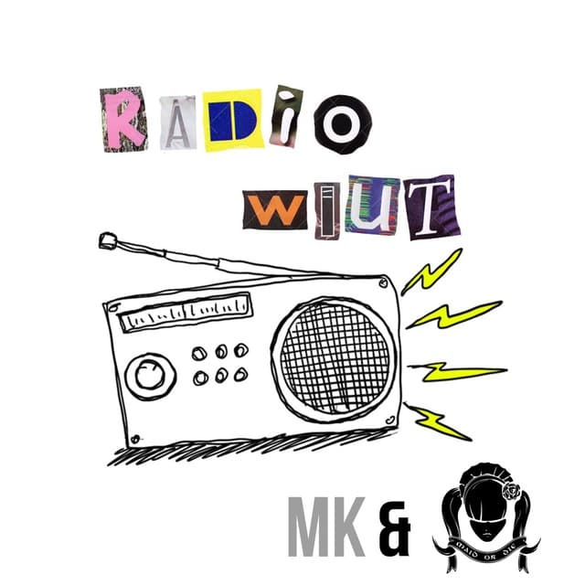

<h2 align="center">Radio WIUT</h2>

 Audio formatted confession for everyone by <a href="https://t.me/madmaids" target="_blank">Mad Maids</a> & <a href="https://t.me/malikaxafizova" target="_blank">Malika Khafizova</a>.

**This bot was built with [telegraf.js](https://github.com/telegraf/telegraf) in
[Node.js](https://nodejs.org/en/). This bot works as package modular, so don't
worry about adding your own customizations. It will not affect to the bot's
working process. Just, don't forget to add your command to action's index and
you're ready to go!**

## Documentations

-   **Telegraf.js** - [Github](https://github.com/telegraf/telegraf)
-   **Telegram Bot API** - [Website](https://core.telegram.org/bots/api)

## Contributors

This bot exists thankfully for those who contributed this project, and they are:

-   [UwUssimo](https://github.com/uwussimo) _(Contributor)_ - Active contributor

> Start contributing to become relative to maid!

---

> The bot page is still in beta phase so feel free to
> [open issues](https://github.com/mad-maids/maid.radio/issues/new) and give me some
> suggestions.

---

> **Important Note:** Under the CC0-1.0 license, you are not allowed to run your
> own instance unless UwUssimo won't permit
> [(this repository)](https://github.com/mad-maids/maid.radio). If you're modifying
> this source and making your own bot, you have to ask for permission from
> creator "UwUssimo" according to the CC0-1.0 license. Check [LICENSE](license)
> for more info.

Copyright &copy; 2020-2022 <a href="https://maid.uz" target="_blank">Mad Maids</a>

